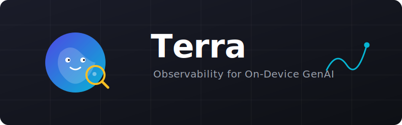

<p align="center">
  
</p>

# Terra

Terra is an OpenTelemetry-native observability SDK for on-device GenAI on Apple platforms.
Instrument inference, streaming, agents, tools, embeddings, and safety checks with privacy-safe defaults.

```swift
import Terra

try await Terra.start()
let result = try await Terra.infer(Terra.ModelID("gpt-4o-mini"), prompt: "Say hello").run { "Hello" }
```

[](https://github.com/christopherkarani/Terra/actions/workflows/ci.yml)
[](LICENSE)
[]()

## Quick Start

Copy-ready snippets live in `Examples/Terra Sample/RecipeSnippets.swift` and compile as-is.

```swift
import Terra

try await Terra.start(.init(preset: .quickstart))
let answer = try await TerraRecipeSnippets.inferRecipe(prompt: userPrompt)
await Terra.shutdown()
```

## Setup Presets

| Preset | Use when | Start call |
| --- | --- | --- |
| `quickstart` | Local dev defaults | `try await Terra.start()` |
| `production` | Persist traces and export in apps | `try await Terra.start(.init(preset: .production))` |
| `diagnostics` | Deep troubleshooting with extra telemetry | `try await Terra.start(.init(preset: .diagnostics))` |

## Span Types

| Span type | Factory | Example |
| --- | --- | --- |
| Inference | `Terra.infer(_:prompt:provider:runtime:temperature:maxTokens:)` | `try await Terra.infer(Terra.ModelID("gpt-4o-mini"), prompt: prompt).run { "ok" }` |
| Streaming | `Terra.stream(_:prompt:provider:runtime:temperature:maxTokens:expectedTokens:)` | `try await Terra.stream(Terra.ModelID("gpt-4o-mini")).run { trace in trace.chunk(tokens: 8); return "ok" }` |
| Agent | `Terra.agent(_:id:provider:runtime:)` | `try await Terra.agent("planner").run { "done" }` |
| Tool | `Terra.tool(_:callID:type:provider:runtime:)` | `try await Terra.tool("search", callID: Terra.ToolCallID()).run { "result" }` |
| Embedding | `Terra.embed(_:inputCount:provider:runtime:)` | `try await Terra.embed(Terra.ModelID("text-embedding-3-small"), inputCount: 3).run { vectors }` |
| Safety check | `Terra.safety(_:subject:provider:runtime:)` | `try await Terra.safety("toxicity", subject: text).run { true }` |

## Privacy Policies

| Policy | Behavior | Use when |
| --- | --- | --- |
| `.redacted` (default) | Captures telemetry metadata with HMAC-SHA256 redaction for content fields | Standard production default |
| `.lengthOnly` | Captures only content lengths (no raw content) | You need shape/size signals only |
| `.capturing` | Allows content capture when opted in per call | Controlled debugging environments |
| `.silent` | Drops content-related telemetry | Strictest privacy mode |

## Composable Call API

Use call composition when metadata is dynamic at runtime:

```swift
let result = try await Terra
  .infer(
    Terra.ModelID(modelName),
    prompt: prompt,
    provider: Terra.ProviderID(providerName),
    runtime: Terra.RuntimeID(runtimeName)
  )
  .capture(.includeContent)
  .attr(.init("app.user_tier"), userTier)
  .attr(.init("app.retry"), false)
  .run { trace in
    trace.responseModel(Terra.ModelID(modelName))
    trace.tokens(input: 128, output: 64)
    return try await llm.generate(prompt)
  }
```

Advanced seams/mocking patterns are documented in [`Docs/API_Cookbook.md`](Docs/API_Cookbook.md) and [`Docs/Front_Facing_API_Examples.md`](Docs/Front_Facing_API_Examples.md).

## Configuration Persistence

```swift
var config = Terra.Configuration(preset: .production)
config.persistence = .defaults()
try await Terra.start(config)
```

## Macros (`@Traced`)

```swift
import Terra
import TerraTracedMacro

@Traced(model: Terra.ModelID("gpt-4o-mini"))
func infer(prompt: String) async throws -> String { try await llm.generate(prompt) }

@Traced(model: Terra.ModelID("gpt-4o-mini"), streaming: true)
func stream(prompt: String) async throws -> String { try await llm.generate(prompt) }

@Traced(agent: "planner")
func agentStep() async throws -> String { "ok" }

@Traced(tool: "search")
func runTool(query: String) async throws -> String { "ok" }

@Traced(embedding: Terra.ModelID("text-embedding-3-small"))
func embed(text: String) async throws -> [Float] { [0.1, 0.2] }

@Traced(safety: "toxicity")
func safety(subject: String) async throws -> Bool { true }
```

## Foundation Models

```swift
#if canImport(FoundationModels)
import FoundationModels
import TerraFoundationModels

@available(macOS 26.0, iOS 26.0, *)
func runFoundationModels(prompt: String) async throws -> String {
  let session = Terra.TracedSession(model: .default)
  return try await session.respond(to: prompt)
}
#endif
```

## Advanced

- Full integrations: [`Docs/Integrations.md`](Docs/Integrations.md)
- Migration guide: [`Docs/Migration_Guide.md`](Docs/Migration_Guide.md)
- API cookbook: [`Docs/API_Cookbook.md`](Docs/API_Cookbook.md)
- Front-facing API reference: [`Docs/Front_Facing_API.md`](Docs/Front_Facing_API.md)
- Front-facing API examples: [`Docs/Front_Facing_API_Examples.md`](Docs/Front_Facing_API_Examples.md)
- Manual GitHub Pages + DocC publish: `Scripts/publish_pages_with_docc.sh`

## Installation (SwiftPM)

```swift
.package(url: "https://github.com/christopherkarani/Terra.git", from: "0.1.0")
```

Common products:

- `Terra`
- `TerraTracedMacro`
- `TerraFoundationModels`
- `TerraMLX`
- `TerraLlama`

## Requirements

- iOS 13+
- macOS 14+
- visionOS 1+
- tvOS 13+
- watchOS 6+

License: Apache-2.0
